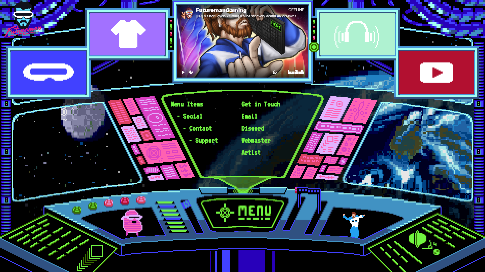

# FuturemanGaming Interactive Webpage
An interactive webpage designed and coded by me rendered using a custom data driven HTML Canvas engine

One of my first commission projects made for Twitch streamer FuturemanGaming

All artwork done by and credited to [@PearIyNerfect](https://twitter.com/peariynerfect)

[Click here for a live preview](https://parkerdev.io/futuremangaming/index.html)

Copyright © 2016 Joshua Parker, ParkerDEV. All rights reserved

/* CLASSES */

/* The Class object is not instantiated, but is instead called from each Component object. This serves as a controller for any entity included in the item's data.This gives different functionality to multiple components without duplicating code.

The build function is called once on the component's creation. This happens immediately before the first tick, so you should only perform initial stuff here like setting instance variables. You can, however call any preloaded images, sounds, etc. since this runs after loading is complete, but before anything is rendered.

The tick function is called every tick. This is where game logic should happen. The entity passed has already been initialized and its data can be accessed or mutated, as well as any other entity's data. */

	// Get the Class object or create a new one if it doesn't exist
System.Class = System.Class || {};

	// Note: Not instantiated. Store any and all instance variables in the
  	entity instance passed to these functions.
System.Class.{CLASS_NAME} = {

	build: function(entity) {
		
	},

	tick: function(entity, e) {
		
	}

}

/* COMPONENTS */

/* Components hold the data for each entity created from the System.data objects.
Each of these components perform different actions, most commonly rendering something on the canvas. Multiple components can be listed in the "requires" object specified in the System.data object.

These are dumb data objects, but you can put commonly used functions in the object's prototype. Game logic should be done in the Class object in which the component's parent entity is passed. */

// Get the Class object or create a new one if it doesn't exist
System.Component = System.Component || {};

System.Components.{COMPONENT_NAME} = function(args, data) {
	
	//	This extends the initial data from the System.data object
	//	into this object. You can include default parameters that
	//	may not be included in the object's data between the brackets.
	Utils.extend(this, {

	}, args, data)

	// Perform initialization stuff here.
}

// Commonly used functions called from the Class object can be set here
System.Component.Sprite.prototype = {
	
}

/* Layers */

/* A layer creates a new canvas which is added to the Layers manager.
The canvas contains a stage, which is a create.js object which holds child elements rendered on the canvas. */

System.data = {
	layers: {
		Layer1: {
			hidden: false,	// Hide the canvas element
			static: false,	// Ignore mouse events. Usefull for overlays
			update: true,	// Don't update the canvas if not necessary
			index: 1,		// The z-index of the canvas element
			x: 0,			// Coordinates for the canvas element
			y: 0,
			width: 100,		// Bounds for the canvas element
			height: 100
		}
	}
}

/* Data */

/* This represents all entities to be added to the layer. Make sure the object name matches the layer name. Components store the data and multiple components can be included in the requires array. Each of these will be instantiated when the entity is created.

Data for each component is included in this object. Again, the object name must be the same as the component name. All logic is performed in the Class object. Classes can be coded to depend on the requires Component objects. However, no data object may depend on the Class object.

For example, an object can be either a static image or an animated spritesheet. The class will make functions calls and read data from the required components. We can list multiple components to be initialized. requires: ['Sprite', 'Spritesheet'] will load the necessary sprite and spritesheet, but will not add them to the canvas scene. This should be done in the Class object.

This way we can easily change class from something like 'StaticImage' to 'AnimatedSprite' without either of the required components having to depend on the type of object.

System.data.Layer1 = {
	Entity1: {
		class: 'Class1',	// This object is called to perform logic
		requires: [			// These are instantiated when loaded
			'Component1',
			'Component2'
		], 

		// Specify the data for this entity
		Component1: {
			image: 'ImageName',
			src: 'image/path/file.png',
			x: 0,			// Coordinates to display the sprite relative to the canvas
			y: 0
		},

		Component2: {
			// You might add animations here, which may be a dependant of Component1
		}

	}
}
